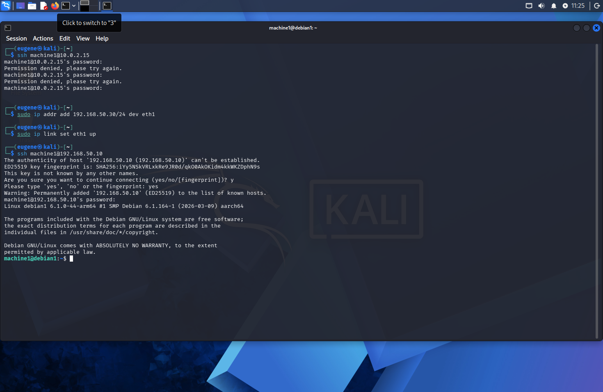
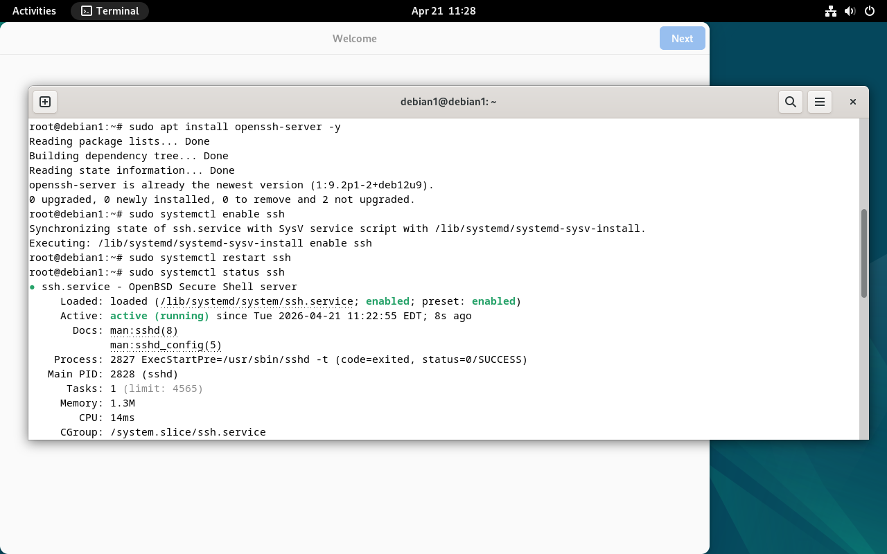
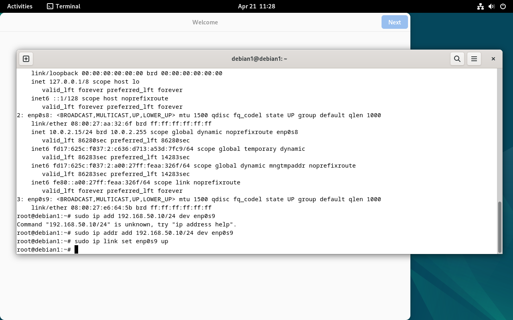

## 🔐 Настройка SSH-доступа между виртуальными машинами


| Устройство         | IP-адрес        |
| ----------         | --------------- |
| Kali               | 192.168.50.30 |
| Debian1 (machine1) | 192.168.50.10 |
| Debian2 (machine2) | 192.168.50.20 |


## 1) Подключение с Kali к Debian1

```bash
sudo ip addr add 192.168.50.30/24 dev eth1
sudo ip link set eth1 up
ssh machine1@192.168.50.10
```
<p align="center">  </p>


## 2) Установка SSH на Debian1

```bash
sudo apt install openssh-server -y
sudo systemctl enable ssh
sudo systemctl restart ssh
sudo systemctl status ssh
```
<p align="center">  </p>

## 3) Настройка IP на Debian1

```bash
sudo ip addr add 192.168.50.10/24 dev enp0s9
sudo ip link set enp0s9 up
```

<p align="center">  </p>

## 4) Подключение с Debian1 к Debian2

```bash
ssh debian2@192.168.50.20
```

<p align="center">  </p>
