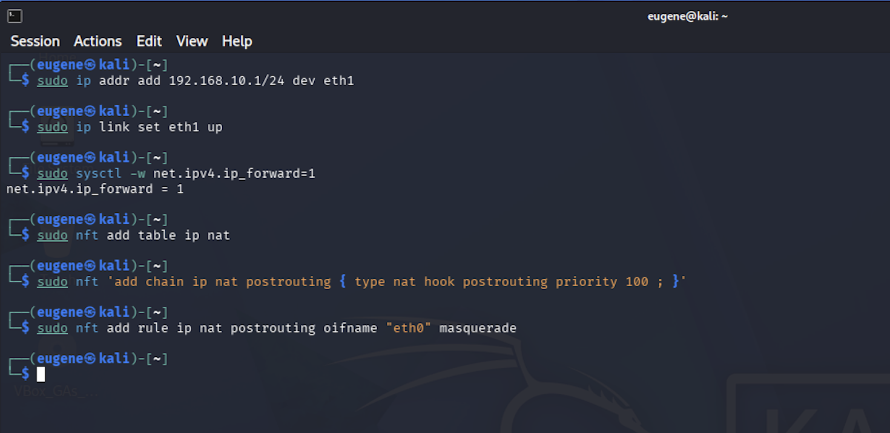
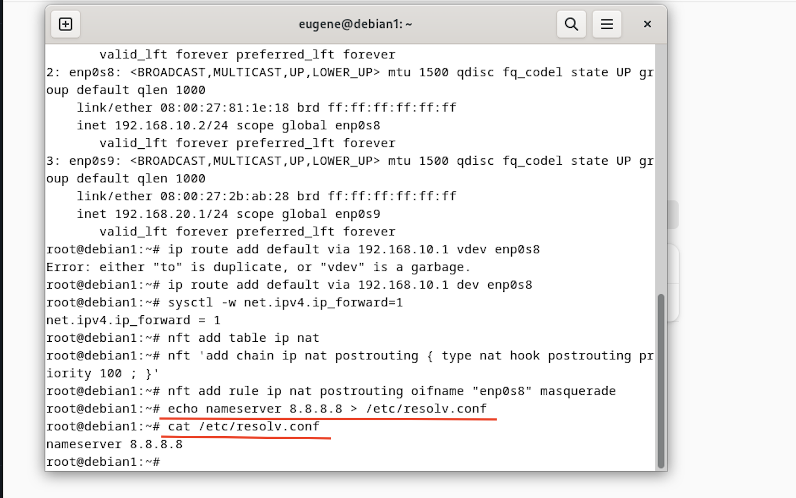

# Построить и настроить следующую сетевую схему:

```text
Kali ← NAT1 ← debian1 ← NAT2 ← debian2
```

## Схема:

                Internet
                    │
             VirtualBox NAT
                    │
                Kali Linux
          eth0: 10.0.2.15
          eth1: 192.168.10.1
                    │
         ─────────────────────
                    │
                Debian1
          enp0s8: 192.168.10.2
          enp0s9: 192.168.20.1
                    │
         ─────────────────────
                    │
                Debian2
          enp0s8: 192.168.20.2

## Таблица адресации:

| Устройство | Интерфейс | IP-адрес        | Назначение       |
| ---------- | --------- | --------------- | ---------------- |
| Kali       | eth0      | 10.0.2.15       | Интернет         |
| Kali       | eth1      | 192.168.10.1/24 | Шлюз для Debian1 |
| Debian1    | enp0s8    | 192.168.10.2/24 | Связь с Kali     |
| Debian1    | enp0s9    | 192.168.20.1/24 | Шлюз для Debian2 |
| Debian2    | enp0s8    | 192.168.20.2/24 | Клиент           |


## Kali Linux:

```bash
sudo ip addr add 192.168.10.1/24 dev eth1
sudo ip link set eth1 up

sudo sysctl -w net.ipv4.ip_forward=1

sudo nft add table ip nat
sudo nft 'add chain ip nat postrouting { type nat hook postrouting priority 100 ; }'
sudo nft add rule ip nat postrouting oifname "eth0" masquerade
```




## Debian 1

```bash
ip addr add 192.168.10.2/24 dev enp0s8
ip addr add 192.168.20.1/24 dev enp0s9

ip link set enp0s8 up
ip link set enp0s9 up

ip route add default via 192.168.10.1 dev enp0s8

sysctl -w net.ipv4.ip_forward=1

nft add table ip nat
nft 'add chain ip nat postrouting { type nat hook postrouting priority 100 ; }'
nft add rule ip nat postrouting oifname "enp0s8" masquerade
```

## Debian 2

```bash
ip addr add 192.168.20.2/24 dev enp0s8
ip link set enp0s8 up

ip route add default via 192.168.20.1
```

## Debian 1 ( DNS )

```bash
echo nameserver 8.8.8.8 > /etc/resolv.conf
```


